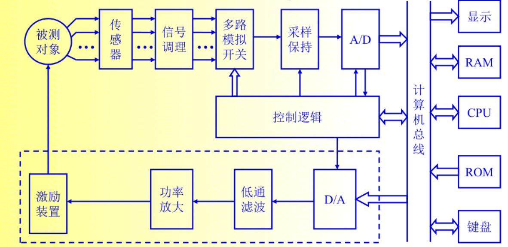

# 第一章 信号及其描述
## 测试系统组成
激励装置--|-->被测对象->传感器->信号调理装置->信号处理装置--|-->显示与记录装置->观察者
           |<-----------------反馈与控制装置<-----------------------|

## 信号及其描述

### 信号的分类
- 确定性信号
	- 周期信号
		- 谐波信号
		- 复杂周期信号
	- 非周期信号
		- 准周期信号
		- 瞬变信号
- 非确定性信号
	- 平稳随机信号
		- 各态历经信号
		- 非各态历经信号
	- 非平稳随机信号

#### 确定性信号
能用明确的数学关系式或图像表达的信号。
分为周期信号与非周期信号。

###### 非周期信号
- 准周期信号
	由两个以上的谐波信号合成，其频率比为无理数，分量之间没有公共周期，无法按某一周期重复出现。
- 瞬变信号
	在一定时间区间内存在或者随着时间的增长而衰减至零的信号，其时间历程较短。

#### 非确定性信号
随机信号，无法用明确的数学关系表达的信号

### 周期信号的三角函数展开
见书P10 例1.1

### 瞬变信号的傅里叶变换
见书P16 例1.3

#### 随机信号
1. 时域函数不能用精确的数学表达关系式来描述；
2. 不能预测它未来任何时刻的准确值；
3. 每次观测的结果不同，通过大量的重复实验可以看到它具有统计规律，可以使用概率统计方法来描述和研究。

##### 非平稳随机过程
统计特征的参数随着时间变化。
##### 平稳随机过程
统计特征的参数不随时间变化。

##### 随机信号的主要统计参数
通常用于描述各态历经随机信号的主要统计参数有均值、均方差、方差、均方根，概率密度函数、相关函数、功率谱密度函数。
- 均值反应信号的静态分量；
- 均方差反应信号的能量或强度；
- 方差反应信号偏离均值的波动情况

# 第二章 信号的分析与处理
## 信号的时域分析
信号的主要统计参数有均值、均方差、方差、均方根以及幅值域的概率密度函数和概率分布函数。

## 信号的频域分析
信号的频域描述反应了信号的频率结构和各频率成分的幅值大小；
功率谱密度函数、相干函数、倒谱分析从频域为研究平稳随机过程提供了重要方法。

#### 帕斯瓦尔(Paseval)定理
信号在时域中的总能量与信号在频域中的总能量相等。

#### 功率谱分析及其应用
$S_x(f)$表示信号的功率密度沿频率轴的分布，故称为功率谱密度函数。

## 数字信号处理
信号分析与处理（数据截断、加窗、奇异点剔除、趋势分离、数字滤波、时域分析、频域分析等）。
#### 采样
连续时间信号离散化的过程。

#### 频率混叠
时域采样间隔过长，造成频域周期化间隔不够大时，在重复频谱交界处出现的局部相互重叠现象。

#### 时域采样和采样定理
==为了防止**频率混叠** 对信号采样的频率必须大于信号最高频率的两倍。==
$$
f_s \geq 2f_c
$$

#### 量化
在模/数转换过程中，对时域上每个间隔的采样分层取值的过程。
量化引起的误差称为量化误差，量化单位越小，信号精度越高，量化误差无法消除。

#### 截断、泄露和窗函数
截断就是将无限长的信号乘以有限宽度的窗函数。
窗函数就是在模/数转换过程中对时域信号采样时所采用的阶段函数。
由于时域上的截断而出现附加频率分量的现象称为泄露。(无论采样频率有多高，信号不可避免地出现混叠)

# 第三章 测试系统的特性
## 测试系统的静态特性
测试系统的静态特性就是静态测量情况下描述实际测试系统与理想定常线性系统的接近程度。

### 非线性度
指测试系统的输入、输出关系保持常值线性比例关系的程度。
在静态测试中，通常用实验测定的办法求得系统的输入、输出关系曲线，称之为定度曲线。
### 灵敏度
灵敏度表征的是测试系统对输入信号变化的一种反应能力。
$$
S = \lim_{\Delta x\to0}\frac{\Delta y}{\Delta x} = \frac{dy}{dx}
$$
放大倍数定义为当输入输出量纲相同时的灵敏度。
灵敏度越高，测量范围越窄，测量系统的稳定性往往越差。

### 分辨率
分辨率是指测试系统能测量到输出量的最小变化量的能力，既能引起输出量发生变化的最小输入变化量。

### 回程误差
回程误差也称之后，由于仪器仪表中的磁性材料的磁滞、弹性材料迟滞现象以及机械结构的摩擦和游隙等原因，在测试过程中输入量在递增过程中的定度曲线与输入量在递减过程中的定度曲线往往不重合。

### 漂移
漂移是指测试系统在输入不变的条件下，输出随时间变化的趋势。
在规定条件下，当输入不变时在规定时间内输出的变化，称为点漂。
在测试系统测试范围最低值处的点漂，称为零漂。
产生原因：
- 仪器自身结构参数变化；
- 周围环境的变化。

### 信噪比
信噪比（SNR）是信号的有用成分与干扰的强弱对比，常以分贝（dB）为单位。

## 测试系统的动态特性
测试系统的动态特性是指输入量随时间变化时，其输出随输入而变化的关系。

### 传递函数
传递函数$H(s)$是对系统特性的一种解析描述，它包含了瞬态、稳态时间响应和频率响应的全部信息。
1.  $H(s)$描述了系统本身的动态特性，而与输入$x(t)$及系统的初始状态无关。
2.  $H(s)$是对物理系统特性的一种数学描述，而与系统的具体物理结构无关。
3.  $H(s)$中的分母取决于系统的结构，而分子则表示系统同外界之间的联系。

### 频率响应函数
频率响应函数是指零初始条件下，定常线性系统稳态输出量的傅里叶变换与引起该输出的输入量傅里叶变换之比。
$$
H(\omega) = \frac{Y(\omega)}{X(\omega)}
$$

频率响应函数反应了测试系统在各个频率正弦信号激励下的稳态响应特性。必须在系统响应达到稳态阶段时才测量。

### 频率特性
$A(\omega)=|H(j\omega)|=\sqrt{P^2(\omega)+Q^2(\omega)}$ 
$\varphi(\omega)=\angle H(j\omega)=arctan\frac{Q(\omega)}{P(\omega)}$
- 幅频特性：$H(\omega)$的模$A(\omega)$反应了定常线性系统在正弦信号激励下，其稳态输出信号与输入信号的幅值比。
- 相频特性：幅角$\varphi(\omega)$反应了稳态输出信号与输入信号的相位差。
- 频率特性：$H(\omega)$频率响应函数，是指幅频特性与相频特性统称。
- 实频特性、虚频特性

### ==一阶系统特性==
- 微分方程： $\tau\frac{\rm d y(t)}{\rm d t}+y(t)=Sx(t)$
- ==传递函数： $H(s)=\frac{S}{\tau s+1}$== 
- 频率特性：$H(\omega)=\frac{S}{1+j\omega\tau}=\frac{S}{\sqrt{1+(\omega\tau)^2}}e^{-jarctan (\tau\omega)}$
- ==幅频特性：$A(\omega)=\frac{1}{\sqrt{1+(\omega\tau)^2}}$，幅度误差为$1-A(\omega)$==
- ==相频特性：$\varphi(\omega)=-arctan(\tau\omega)$ 式中，负号表示输出滞后于输入信号==
- 脉冲响应函数： $h(t)=\frac{1}{\tau}e^{-t/\tau}$，$t\geq0$
式中：时间常数$\tau=a_1/a_0$，系统灵敏度$S=b_0/a_0$。对于实际系统，$S$是一个常数，为了分析方便起见，令$S=1$。

- 当激励频率$\omega$远小于$1/\tau$时，约$\omega<1/(5\tau)$，$A(\omega)\approx1$（误差不超过2%），$\psi(\omega)\approx0$。
- 当$\omega\tau \gg1$时，$y(t)\approx\frac{1}{\tau}\int_0^t{x(t)}$，系统相当于一个积分器。其中$A(\omega)$几乎与激励频率成反比，$A(\omega)\rightarrow0,\varphi(\omega)\rightarrow-90\degree$，相位滞后近$90\degree$。
- $\omega=1/\tau$处，$A(\omega)=0.707(-3dB)$，相角滞后$45\degree$。此时的$\omega$常称为系统的**截止频率**。
- 时间常数$\tau$决定了一阶系统适用的频率范围。$\tau$越小，系统的响应速度越快。

### 二阶系统的特性
- 微分方程：$m\ddot y(t)+c\dot y(t)+ky(t)=x(t) \Rightarrow \ddot y+2\zeta\omega_n \dot y+\omega_n^2y=S\omega_n^2x$
- 传递函数：$H(s)=\frac{S\omega_n^2}{s^2+2\zeta\omega_n s+\omega_n^2}$
- 频率响应函数：$H(\omega)=\frac{S\omega_n^2}{\big[ 1-\big(\frac{\omega}{\omega_n}\big)^2\big]s^2+j2\zeta\big(\frac{\omega}{\omega_n}\big)}$
式中：固有频率$\omega_n=\sqrt{a_0/a_2}$，阻尼比$\zeta=\frac{a_1}{2\sqrt{a_0 a_2}}$，静态灵敏度$S=b_0/a_0$ 
对于实际系统，$S$是一个常数，为分析方便起见，令$S=1$。
- 幅频特性：$A(\omega)=|H(\omega)|=\frac{1}{\sqrt{\big[1-(\omega/\omega_n)^2\big]^2+4\zeta^2(\omega/\omega_n)^2}}$
- 相频特性：$\varphi(\omega)=-arctan\frac{2\zeta \omega/\omega_n}{1-(\omega/\omega_n)^2}$
- 脉冲响应函数：$h(t)=\frac{\omega_n}{\sqrt{1-\zeta^2}}e^{-\zeta\omega_n t}sin\sqrt{1-\zeta^2}\omega_n t,(t\geq0,0\leq\zeta\leq1)$

	- $\omega\ll\omega_n$时，$H(\omega)\approx1,A(\omega)\approx1,\varphi(\omega)\rightarrow0\degree$
	- $\omega\gg\omega_n$时，$H(\omega)\rightarrow,A(\omega)\rightarrow0,\varphi(\omega)\rightarrow-180\degree$
	- $\omega=\omega_n$时，$A(\omega)=1/(2\zeta),\varphi(\omega)=90\degree$，且在$\omega=\omega_n$附近，系统发生共振，$\varphi(\omega)$变化剧烈，且$\zeta$越小，变化越剧烈。课利用此特性测量系统本身参数。
	- $\omega_n$和$\zeta$的大小影响二阶系统的动态特性，且在通常使用的频率范围中，$\omega_n$的影响最为重要。
	- 二阶系统时振荡环节，对测试系统而言，为了减少频率特性不理想所引起的误差，一般取$\omega\leq(0.6~0.8)\omega_n,\zeta=0.65~0.7$。此时，$\varphi(\omega)$与$\omega/omega_n$近似成线性关系，系统响应速度较快且误差较小。

### 不失真测试条件
信号不失真测试是指系统响应$y(t)$的波形和输入$x(t)$的波形完全相似，从而保留原信号的特征和全部信息。
测试系统的输出应满足:
$$
y(t)=A_0x(t-t_0)
$$
其中，$A_0,t_0$为常数。
不失真测试系统的幅频特性和相频特性应分别满足
$$
\begin{cases}
A(\omega)=A_0\\
\varphi(\omega)=-t_0\omega
\end{cases}
$$
幅频特性在频谱范围内为常数；
相频特性与$\omega$成线性关系，为一经过原点的直线。

# 第四章 传感器
传感器是一种以一定的精度和规律把规定的被测量转换为与之有确定关系的、便于应用的某种物理量的器件或装置。
传感器一般由敏感元件和转换元件组成。
- 敏感元件是指传感器中能直接感受或响应被测量的器件；
- 转换元件是指传感器中能将敏感元件感受或响应的被测量转换为适于传输或测量的电信号的器件。
## 传感器的选用原则
1. 被测量类型；
2. 测试环境，环境是否有电磁场、温度的干扰；
3. 测试范围；
4. 测量方式，接触式或非接触式；
5. 传感器体积和安装方式；
6. 其他因素，例如传感器的来源、价格。

确定传感器的类型后，该确定传感器的参数
1. 灵敏度：灵敏度越高，可以感知越小的变化量，对噪声更敏感，需要较大的信噪比，传感器的量程与灵敏度进行相关。
2. 响应特性：传感器的响应特性必须在所测频率范围内尽量保持不失真。响应的延迟时间越短越好。
3. 稳定性：指经过了长期使用以后，其输出特性不发生变化的性能。
4. 精度：传感器的精度表示传感器的输出与被测量的对于关系，应该在精度与经济性之间权衡。

## 传感器工作原理与特点
### **电阻应变式传感器**
电阻应变式传感器的核心元件是==电阻应变片==。当被测试件或弹性敏感元件收到被测量作用时，将产生位移、应力、和应变，则粘贴在被测试件或弹性敏感元件上的电阻应变片将应变转换成电阻的变化，再通过测量电路变成电压等电量输出，从而确定被测量的大小。
电阻应变式传感器的主要优点如下：
1. 性能稳定、精度高；
2. 测量范围宽；
3. 频率响应较好；
4. 体积小、重量轻、结构简单、价格低、使用方便、使用寿命长；
5. 对环境条件适应能力强。

缺点：
1. 输出信号弱；
2. 在大应变状态下具有明显的非线性。

#### 金属电阻应变片
金属导体在外力作用下发生机械变形时，其电阻值随着机械变形发生变化的现象，称为金属的==电阻应变效应==。
$$
R=\rho\frac{L}{A}
$$
$R$——未受力时的电阻；
$L$——金属丝的长度；
$A$——横截面积；
$\rho$——电阻率。

$S_0$为金属丝的灵敏度，其物理意义时单位应变所引起的电阻相对变化。

金属电阻应变片的分类：丝式、箔式、薄膜式。
按基底材料分类：纸基、胶基。（对基底材料的性能有如下要求：力学性能好、挠性好、易于粘贴、电绝缘性能好、热稳定性和抗潮湿性能好、滞后和蠕变小）
按测量应力场分类：测量单向应力和测量平面应力。

#### 半导体电阻应变片
半导体材料受到应力作用时，其电阻率会发生变化，这种现象称为==压阻效应==。
优点：
1. 灵敏度高；
2. 尺寸小；
3. 横向效应小；
4. 滞后和蠕变小。

缺点：
1. 温度稳定性差；
2. 测量较大应变时非线性严重；
3. 批量生产时性能分散度较大。

#### 电位器式传感器
电刷相对于电阻元件的运动可以是直线运动、转动和螺旋运动，因而可以将直线位移或角位移转换为与其呈一定函数关系的电阻或电压输出。
优点：
1. 结构简单、尺寸小、质量小、价格低廉且性能稳定；
2. 受环境影响小；
3. 可以实现输出-输入间任意函数关系；
4. 输出信号大，无需放大。

缺点：
1. 由于电刷与线圈或电阻膜之间存在摩擦，因此需要较大的输入能量；
2. 磨损不仅影响使用寿命和降低可靠性，而且会降低测量精度，分辨率较低；
3. 动态响应较差，适合用于测量变化缓慢的量。

### 电感式传感器
电感式传感器式基于电磁感应原理，将被测非电量转换为电感量变化的一种结构型传感器。利用自感原理的有自感式传感器，利用互感原理的有互感式传感器和感应同步器，利用涡流效应的有涡流传感器。

#### 涡流传感器
集肤效应：涡流在导体的纵深方向并不是均匀分布的，而只是集中在金属导体的表面，这称为集肤效应
高频反射式涡流传感器：高频激励电流施加于邻近金属板一侧的线圈上，由线圈产生的高频电磁场作用于金属板的表面。当被测位移量发生变化时，使线圈与金属板的距离发生变化，从而导致线圈阻抗$z_L$的变化，通过测量电路转化为电压输出。多用于位移测量。
低频透射式涡流传感器：多用于测定材料厚度。
涡流传感器可用于动态非接触测量，它具有结构简单、安装方便、灵敏度高、抗干扰能力较强、不受油污等介质的影响等优点。

# 第五章 信号调理与记录
信号调理的目的是便于信号的传输与处理。
1. 传感器输出的信号很微弱，需要放大后才能使用，有的还要进行阻抗变换。
2. 传感器输出的信号中混杂有干扰信号，需要去除噪声，提高信噪比。
3. 为了便于信号的远距离传输，需要对传感器测量信号进行调制解调处理。
## 电桥
将电阻、电感、电容等参量变化变为电压或电流输出的一种测量电路。
### 直流电桥
电桥输出电压
$$
u_0=\frac{R_1R_3-R_2R_4}{(R_1+R_2)(R_3+R_4)}u_i
$$
电桥平衡条件
$$
R_1R_3=R_2R_4
$$
连接方式:
1. 半桥单臂：$u_o\approx\frac{\Delta R_0}{4R_0}u_i, \Delta R_0\ll R_0。S_B=\frac{u_o}{4\Delta R_0/R_0}$
2. 半桥双臂：$u_o=\frac{\Delta R_0}{2R_0}u_i, R_1\rightarrow R_1\pm\Delta R_1, R_2\rightarrow R_2\mp\Delta R_2, S_B=\frac{u_o}{2\Delta R_0/R_0}$
3. 全桥：$u_0=\frac{\Delta R_0}{R_0}u_i,  R_1\rightarrow R_1\pm\Delta R_1, R_2\rightarrow R_2\mp\Delta R_2,  R_3\rightarrow R_3\pm\Delta R_3, R_4\rightarrow R_4\mp\Delta R_4, S_B=\frac{u_o}{\Delta R_0/R_0}$
三种接法的灵敏度比分别为$1:2:4$。

!!!note
- 相邻两臂电阻增量符号相反；
- 相对两臂电阻增量符号相同。

### 交流电桥
电桥平衡条件
$$
\begin{cases}
Z_1Z_3=Z_2Z_4 \\
\varphi_1+\varphi_3=\varphi_2+\varphi_4
\end{cases}
$$
阻抗的模、阻抗角相等。

## 滤波器
### 滤波器的分类
根据选频作用分类：
- 低通滤波器：通频带$0\sim f_2$
- 高通滤波器：通频带$f_1\sim \infty$
- 带通滤波器：通频带$f_1\sim f_2$
- 带阻滤波器：通频带$0\sim f_3$和$f_4\sim\infty$
根据滤波器元件类型分类：RC、LC、晶体谐振以及开关电容滤波器。
根据滤波器的电路性质分类：有源、无源滤波器。
根据滤波器所处理的信号性质分类：模拟、数字滤波器。

### 滤波器的特性参数
1. 截止频率：定义幅频特性值等于$\frac{A_0}{\sqrt{2}}$所对应的频率称为滤波器的截止频率。以$A_0$为参考值，$\frac{A_0}{\sqrt{2}}$相对于$A_0$衰减-3dB。
2. 带宽B：通频带的宽度称为带宽B，这里上下两截止频率之间的频率范围，即$B=f_{c2}-f_{c1}$,单位为Hz，带宽决定着滤波器分离信号中相邻频率成分的能力，即==频率分辨率==。
3. 品质因数Q：定义中心频率$f_0$和带宽B之比为滤波器的品质因数
$$
Q=\frac{f_0}{B}
$$
其中心频率定义为上下截止频率的乘积的平方根，即$f_0=\sqrt{f_{c1}f_{c2}}$，品质因数越大，滤波器==分辨力越高==。
4. 纹波幅度d：实际滤波器在通频带内可能出现纹波变化，其波动幅度d与幅频特性的稳定值$A_0$相比越小越好，一般应远小于-3dB，即$d\ll \frac{A_0}{\sqrt2}$。
5. 倍频程选择性：实际滤波器至稳定状态需要一定的建立时间$T_e$，因此在上下截止频率外侧有一个过渡带，其幅频曲线的倾斜程度表明了幅频特性衰减的快慢，它决定着滤波器对带宽外频率成分衰阻的能力。频率比那花一个倍频程时的衰减量称为倍频程选择性。衰减越快，滤波器选择性越好。

### RC调谐式滤波器
截止频率：$f_{c2}=\frac{1}{2\pi RC}$

#### RC低通滤波器
$f_{c2}\ll \frac{1}{2\pi RC}$时，其幅频特性$A(f)=1$。信号不受衰减通过。
$f_{c2}=\frac{1}{2\pi RC}$时，其幅频特性$A(f)=\frac{1}{\sqrt{2}}$。截止频率。
$f_{c2}\gg \frac{1}{2\pi RC}$时，输出信号与输入信号的==积分==成正比。

构造RC低通滤波器的电路时，可以使用一个电阻和一个电容串联连接。输入信号通过电阻进入电容，电容的另一端接地。输出信号从电容两端取出。

#### RC高通滤波器
$f_{c2}\ll \frac{1}{2\pi RC}$时，输出信号的==微分==与输入信号成正比。
$f_{c2}=\frac{1}{2\pi RC}$时，其幅频特性$A(f)=\frac{1}{\sqrt{2}}$。截止频率。
$f_{c2}\gg \frac{1}{2\pi RC}$时，信号不受衰减通过。

构造RC高通滤波器的电路时，可以使用一个电阻和一个电容串联连接。输入信号通过电容进入电阻，电阻的另一端接地。输出信号从电阻两端取出。

### 恒带宽滤波器
恒带宽滤波器带宽B恒定，当$f_0$变化时，带宽B不变，在所有频带内都具有良好的频率分辨力。
### 恒带宽比滤波器
其带宽B不是常数，$\frac{B}{f_0}=\frac{1}{Q}$的比值Q不变，中心频率越高，带宽越大。
恒带宽比滤波器的低端截止频率$f_{c1}$与高端截止频率$f_{c2}$之间满足如下关系
$$
f_{c2}=2^n f_{c1}
$$
其中n称为倍频程数，n=1称为倍频程滤波器；n=1/3称为1/3倍频程滤波器。倍频程数越小，Q值越大，频率分辨力越高。

# 第六章 现代测试系统

## A/D转换
A/D转换器是将模拟信号转换为数字信号的装置。
A/D转换过程：
1. 采样：将连续的模拟信号在时间上离散化，得到一系列离散的采样值；
2. 量化：将采样值在幅值上离散化，得到一系列离散的数字信号；
3. 编码：将量化后的数字信号转换为二进制数。
采样保持器：在采样过程中，为了防止孔径时间带来的孔径误差，在A/D转换开始时将信号电平保持不变，在A/D转换结束后又能跟踪输入信号的变化。

## D/A转换
D/A转换器是将数字信号转换为模拟信号的装置。

## 量和量纲
量是指现象、物体或物质可定性区别和定量确定的一种属性。
- 量值：量值是用数值和计量单位和乘积来表示的。
- 基本量和导出量：在量制中，约定的认为基本量时相互独立的量，而导出量是由基本量按一定函数关系来定义的。
- 量纲：量制中可用基本量的幂的乘积来表示任何一个量的表达式。
- 量纲法则：等号两边的量纲应当相同。

## 计量
- 实现单位统一和量值准确可靠的测量。
- 计量学：研究测量、保证测量统一和准确的科学。

## 基准和标准
- 基准：用来保存、复现计量单位的计量器具。基准通常分为国家基准、副基准和工作基准。
- 计量标准：用于检定较低等级计量标准或工作计量器具的计量器具。
- 工作计量器具：用于现场测量而不用于检定工作的计量器具。

## 测量方法分类
- 测量方法：在实施测量中所涉及的一套理论运动和实际操作。其中包括了测量原理和获得所测量结果的方式。
- 测量方法的分类：
  - 直接测量、间接测量
  - 直接比较测量法和代替测量法
  - 接触测量和非接触测量

动态测量与静态测量
- 静态测量：被测量可以认为是恒定的
- 动态测量：被测量随时间变化。目的是测量被测量的瞬时值及其随时间变化的规律

# 第八章 振动的测量
## 振动测量的形式和目的：
- 测量机械或结构在工作状态下的振动量，如振动位移、速度、加速度等。
  - 测定振级、状态检测、故障诊断、环境控制、等级评定。
- 对机械设备或结构施加某种激励，测量其受迫振动
  - 获取设备的动态性能：固有频率、阻尼、频率响应、模态等。
  - 改进设计，提高其抗振能力。

## 振动的基础
- 振动：在一定条件下，振动体在其平衡位置附近随时间作来回往复变化的运动。
- 振动三要素
  - 幅度：振动体偏离平衡位置的最大位移。
  - 频率：周期的倒数，频谱分析->频率成分及其幅值大小->线性系统频率保持特性寻找振源。
  - 相位：确定共振频率、振型、动平衡、有源振动控制。

- 位移：研究强度和变形的重要依据
- 速度：决定能量的高低，人对振动的敏感程度在很大频率范围内是由速度决定的。
- 加速度：与作用力和载荷成正比，是研究动力强度和疲劳的重要依据。

## 振动测量传感器
按测振参数分类：
- 位移传感器
- 速度传感器
- 加速度传感器
按变分原理分类：
- 磁电式
- 压电式
- 电阻应变式
- 电感式
- 电容式
按传感器与被测关系分类：
- 接触式传感器，有磁电式、压电式及电阻应变式传感器
- 非接触传感器，有电涡流式和光学式
按参考坐标分类:
- 相对式传感器：以空间某一固定点作为参考点，测量物体上某点对参考点的相对振动。
- 绝对式传感器：以大地为参考基准，即以惯性空间为基准，测量振动物体相对于大地的绝对振动，又称惯性式传感器。

### 涡流式位移传感器
电涡流传感器式通过传感器端部线圈于被测物体间的间隙变化来测量物体的振动和静位移。
特点：
- 结构简单
- 非接触式测量
- 线性度好
- 具有较强的抗干扰能力
- 测量范围<10mm
- 频率响应范围较宽

### 磁电式速度传感器
绝对式速度传感器通过测量振动体的速度来获取其振动信息。
特点：
- 不需要外部电源
- 输出阻抗低
- 不需特殊后接电路
- 内部运动部分易磨损
- 对磁场敏感
- 测试频率范围：10Hz~1000Hz
- 运动部分的摩擦将使输出信号减小

### 压电式加速度传感器
利用晶体材料的压电效应，惯性质量运动时产生的惯性力作用在压电晶体上，压电晶体产生相应大小的电荷。
- 频带极宽(0.2~20kHz)
- 质量小
- 动态范围大、无运动磨损、高稳定性

灵敏度：电压灵敏度(mV/g)；电荷灵敏度(pC/g)
对于给定的压电材料而言，灵敏度随质量块的增大或压电片的增多而增大。
前置放大器：要求具有极高的输入阻抗，以减少电荷泄漏，电压放大器、电荷放大器。

## 传感器的选择
直接测量参数的选择：
- 低频时加速度的幅值~测量噪声相当->用位移拾振器更合理
- 用位移拾振器测高频位移同理

应使最重要的参数能以最直接、最合理的方式测得
- 考察惯性力可能导致的破坏或故障时宜做加速度测量。
- 考察振动环境(采用振动烈度)宜做振动速度的测量。
- 要检测机器的位置变化时，宜选用电涡流或电容传感器做位移的测量。
- 选择时还需要注意能在实际机器设备安装的可行性。

传感器的频率范围、量程、灵敏度
各种拾振传感器都受其结构的限制而有其自身适用的范围。
- 拾振器质量大，其上限频率低、灵敏度高。
- 质量轻的拾振器上限高、灵敏度低。

使用环境、价格、寿命、可靠性、维修、校准
- 激光测振有很高的分辨力和测量精确度。对环境（隔振）要求极严、设备又极昂贵。只适用于特殊环境下测量，如实验室测量、校准等。
- 电容、电涡流传感器属于非接触式传感器。
- 电涡流传感器对环境要求低而被广泛应用于工业现场对机器振动的测量中，且能在高温、油污、蒸汽介质环境下长期可靠地工作。
- 对相位有严格要求时，除了应注意拾振器的相频特性外，还要注意放大器的相频特性和测试系统中所有其他仪器的相频特性。

# 第十三章 测量误差理论与数据处理

## 真值与误差
- 真值：在某一时刻和某一位置的某个物理量客观存在的真实值。
- 在特定条件下用某种一起和方法可以测得一系列量值
- 真值通常无法测得，只能测得近似值。
- 约定真值：世界各国公认的几何量和物理量的最高基准的量值。
- 理论真值：设计时给定或用数学、物理公式计算出的给定值。
- 相对真值：标准一起的测得值或用来作为测量标准用的标准器的值。
- 绝对误差：测量值与真值之差，$测量误差\Delta x=测得量x-真值x_0$。
- 相对误差：绝对误差与真值之比，$相对误差\varepsilon=\frac{\Delta x}{x_0}\times 100\%$。
- 当测量的绝对误差很小时，可近似用绝对误差与测量值之比来表示相对误差，$\varepsilon=\frac{\Delta x}{x}\times 100\%$。

## 误差分类
按误差来源：装置误差、环境误差、方法误差、人员误差。
按掌握程度：已知误差、未知误差。
按变化速度：静态误差、动态误差。
按特性规律：系统误差、随机误差、粗大误差。

- 系统误差：由特定原因引起的误差，具有一定因果关系并按确定规律产生。
- 随机误差：由多种不确定因素引起的误差，具有随机性和不可预见性。
- 粗大误差：检测系统各组成环节发生异常和故障等引起的误差。

按误差原因：
1. 准确度：表征测量结果接近真值的程度。系统误差大小的反应。
2. 精密度：反应测量结果的分散程度。表示随机误差的大小。
3. 精确度：表征测量结果与真值之间的一致程度。系统误差和随机误差的综合反映。

## 测量误差的影响及其消除
1. 逐项分析法
对测量中可能产生的误差进行分析、逐项计算出其值、并对其中主要项目按照误差性质的不同，用不同的方法综合成总的测量误差极限。
反应出各种误差成分在总误差中所占比重-产生误差的主要原因-减小误差应主要采取的措施。
适用：拟定测量方案；研究新的测量方法、设计新的测量装置和系统。

2. 实验统计法
应用数理统计的方法对在实际条件下所获得的测量数据进行分析处理，确定其最可靠的测量结果和估算其测量误差的极限。
适用：一般测量；对测量方法和测量仪器的实际精度进行估算和校验。

## 系统误差的消除
1. 分析系统误差产生的原因
	防止系统误差出现的最基本办法
	测量前对可能产生误差因素进行分析，采取对于的措施。
2. 引入修正值进行校正
	已出现的系统误差，理论分析的实验研究，系统误差的具体数值和变化规律
	确定修正值；修正表格、修正曲线、修正公式、按规律校正。
3. 检测方法上消除或减小
	实际测量中，采取有效的测量方法。
	现有仪器设备取得更好的效果。

### 粗大误差的减少办法和剔除准则
显然与事实不符、歪曲的测量结果应主观避免、剔除。
1. 物理判别法
2. 统计判别法
	- 拉依达准则(3σ准则)
	- 肖维勒准则

### 随机误差的分析处理
1. 分布：
	高斯分布：大多数都为正态分布；
	均匀分布：量化误差、舍入误差；
	其他：正弦分布、二次分布、卡方分布、指数分布、β分布、γ分布
2. 特点：
	对称性：可正可负，绝对值相等的正负误差出现的机会相等。
	有界性：绝对值不会超过一定的范围、绝对值很大的误差几乎不会出现。
	抵偿性：测量次数越多，全体误差函数的代数和趋于零。
	单峰性：绝对值小的误差出现机会多，平均值处随机误差概率密度由最大值。
3. 特征量：
	数学期望$\mu$
	方差$\sigma^2$
	标准差$\sigma$

### 数据处理的一般方法
1. 最小二乘法 —— 残差平方和最小
2. 回归分析 —— 线性回归、非线性回归